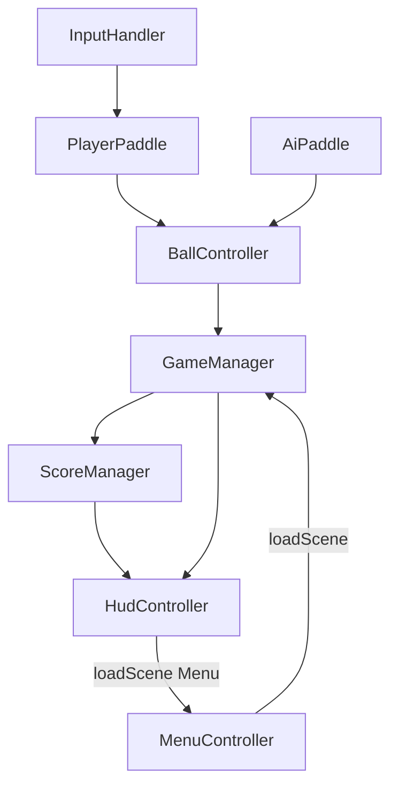

# Kiến trúc dự án PingPong

Tài liệu **cụ thể cho repo này** — bổ sung cho coding rules chung (`.cursor/skills/theone-cocos-standards/`).

> Trạng thái hiện tại: **F006 done** — Menu ↔ Game scene flow.

## Nguyên tắc

1. **Entity-Component:** Logic trên Component, data/config qua `@property`
2. **GameManager điều phối:** Trạng thái trận tập trung, component con báo sự kiện
3. **Event qua Node hoặc EventTarget:** Không singleton global tùy tiện ngoài GameManager
4. **Một `@ccclass` chính mỗi file** — tên file = tên class (PascalCase)

## Sơ đồ tổng quan (MVP)



## Managers & Components

| Thành phần | Vai trò | Lifecycle chính |
|------------|---------|-----------------|
| `GameManager` | State machine + delay 1s giữa điểm; `GameOver` + `match-ended` | Lắng nghe `ball-out` |
| `BallController` | Custom velocity move; va chạm 2 vợt; phát `paddle-hit`, `ball-out` | `update` chỉ khi `setPlaying(true)` |
| `AiPaddle` | Đuổi bóng theo trục Y, tốc độ/phản xạ config `@property` | `update` khi bóng qua `chaseThresholdX` |
| `ScoreManager` | Điểm player/AI, win `@property winScore` (5) | `addPoint()` → `score-changed` |
| `HudController` | Label tỉ số + message + nút Chơi lại/Menu | Lắng nghe `score-changed`, `match-ended` |
| `MenuController` | Nút Chơi → `loadScene(Game)` | `onEnable` đăng ký click |
| `InputHandler` | Map touch/key → vị trí vợt player | `onEnable`/`onDisable` đăng ký input |

## State machine (GameManager)

```
Ready
  → Serving     (bóng ở vị trí serve, chờ input)
  → Playing     (bóng di chuyển)
  → PointScored (pause ngắn, cập nhật điểm)
  → Serving | GameOver
```

## Events (custom)

Định nghĩa tên event dạng `kebab-case`. Payload gợi ý:

| Event | Payload | Ghi chú |
|-------|---------|---------|
| `paddle-hit` | `{ side: 'player' \| 'ai', hitOffset: number }` | Điều chỉnh góc phản xạ |
| `ball-out` | `{ scorer: 'player' \| 'ai' }` | Bóng ra biên |
| `score-changed` | `{ player: number, ai: number }` | |
| `match-ended` | `{ winner: 'player' \| 'ai' }` | |

**Pattern đăng ký (TheOne):** `onEnable` register, `onDisable` unregister, cleanup `onDestroy`.

## Thư mục script (quy ước)

```
assets/scripts/
├── GameEvents.ts
├── GameManager.ts
├── BallController.ts
├── PaddleBase.ts
├── PlayerPaddle.ts
├── InputHandler.ts
├── AiPaddle.ts
├── ScoreManager.ts
├── HudController.ts
├── MenuController.ts
├── SceneNames.ts
├── AudioManager.ts      # phase sau (bỏ qua — chưa có asset)
└── utils/
    ├── ApplyDefaultSpriteFrame.ts
    └── SceneLoader.ts
```

Util thuần (không `@ccclass`) có thể đặt `assets/scripts/utils/` nếu cần.

## Scene ownership

- Một instance `GameManager` trên root hoặc node `Managers` trong `Game.scene`
- Bóng và vợt là prefab instance; reference inject qua Inspector

## Khác với skill TheOne

| Skill (chung) | Dự án PingPong (cụ thể) |
|---------------|-------------------------|
| Pattern EventDispatcher | Dùng event tên ở bảng trên; GameManager là hub |
| Playable optimization | MVP 2D sprite, mục tiêu &lt;10 DrawCall, bundle &lt;5MB |
| Component system | Paddle/Ball tách component; không god class |
