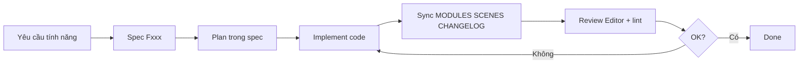

# Luồng làm việc dự án PingPong

Tài liệu này mô tả quy trình chuẩn khi thêm hoặc sửa tính năng. **Agent và developer đều tuân theo thứ tự bên dưới.**

## Tóm tắt 5 bước

| Bước | Tên | Ai làm | Đầu ra |
|------|-----|--------|--------|
| 1 | **Spec** | Human hoặc Agent (theo brief) | `docs/features/Fxxx-*.md` |
| 2 | **Plan** | Agent | Mục *Plan* trong file spec |
| 3 | **Implement** | Agent | Code + scene/prefab |
| 4 | **Đồng bộ tài liệu** | Agent (ngay sau khi hoàn thành) | `01-MODULES`, `02-SCENES`, `04-CHANGELOG` |
| 5 | **Review** | Human (Editor) + Agent (lint) | Checklist review |

---

## Bước 1 — Spec (trước khi code)

**Mục tiêu:** Mô tả rõ *cái gì* và *tại sao*, chưa đi sâu implementation.

1. Copy `docs/features/_template.md` → `docs/features/Fxxx-<ten-tinh-nang>.md`
2. Đặt ID tăng dần (`F001`, `F002`, …), không tái sử dụng ID đã xóa
3. Điền đủ các mục bắt buộc (xem template)
4. Cập nhật trạng thái module liên quan trong `01-MODULES.md` → `planned`

**Agent:** Khi nhận yêu cầu tính năng mới, **đọc hoặc tạo spec trước**. Không code nếu spec chưa có hoặc còn mục `[TBD]`.

---

## Bước 2 — Plan (chia task)

**Mục tiêu:** Liệt kê file sẽ tạo/sửa, thứ tự thực hiện, phụ thuộc.

Agent điền mục **Plan** trong file spec:

```markdown
## Plan

- [ ] Tạo `assets/scripts/BallController.ts`
- [ ] Tạo prefab `Ball` trong Editor (human)
- [ ] Gắn script, wire `@property` trong scene `Game`
- [ ] Cập nhật `01-MODULES.md`, `02-SCENES.md`
```

Quy ước:

- Mỗi task ≤ 1 file script hoặc 1 nhóm thay đổi scene liên quan
- Ghi rõ task nào **Agent code**, task nào **Human làm trong Editor** (prefab, animation, audio)
- Nếu phụ thuộc module khác, ghi ID module trong `01-MODULES.md`

---

## Bước 3 — Implement

**Mục tiêu:** Code khớp spec, tuân rules dự án.

Thứ tự đọc trước khi viết code:

1. `docs/features/Fxxx-*.md` (spec + plan)
2. `docs/03-ARCHITECTURE.md` (manager, event, state hiện có)
3. `.cursor/skills/theone-cocos-standards/SKILL.md`
4. Rule `cocos-typescript.mdc` (khi sửa `assets/**/*.ts`)

Trong lúc implement:

- Giữ diff nhỏ, đúng phạm vi spec
- Chạy `npm run lint` trước khi báo hoàn thành
- Không sửa `library/`, `temp/`, `local/`, `build/`, `profiles/`
- Cập nhật trạng thái spec → `in-progress`

---

## Bước 4 — Đồng bộ tài liệu (bắt buộc)

**Ngay sau khi implement xong** (trước khi báo done), agent cập nhật:

| File | Nội dung cập nhật |
|------|-------------------|
| `docs/01-MODULES.md` | Trạng thái module: `done` / `doing` / `planned` |
| `docs/02-SCENES.md` | Scene/prefab mới, reference script, luồng chuyển scene |
| `docs/03-ARCHITECTURE.md` | Manager/Event/State mới (nếu có) |
| `docs/04-CHANGELOG.md` | Một dòng theo format bên dưới |
| `docs/features/Fxxx-*.md` | Trạng thái → `done`, tick plan `[x]` |

### Format CHANGELOG (một dòng)

```
YYYY-MM-DD | Fxxx | <loại>: <mô tả ngắn> | <file chính>
```

Loại: `add` | `change` | `fix` | `remove`

Ví dụ:

```
2026-07-23 | F001 | add: Ball di chuyển và va chạm tường | BallController.ts
```

---

## Bước 5 — Review

### Agent (tự kiểm tra)

- [ ] `npm run lint` pass
- [ ] Spec và plan đã tick đủ
- [ ] Docs (MODULES, SCENES, CHANGELOG) đã cập nhật
- [ ] Không `console.log` thừa (production-ready)

### Human (Cocos Creator Editor)

- [ ] Scene mở không lỗi missing script / missing reference
- [ ] Prefab reference đúng (`@property` không null)
- [ ] Play mode: gameplay khớp acceptance criteria trong spec
- [ ] Build preview (nếu liên quan playable): không lỗi runtime

### Lệnh xác nhận review (không tick tay)

Sau khi test Play mode OK trong Editor, chạy **một trong hai cách**:

| Cách | Lệnh |
|------|------|
| Terminal | `npm run review:done -- F001` |
| Chat Cursor | `/da-kiem-tra-xong` hoặc `/da-kiem-tra-xong F001` |

Script `scripts/mark-review-done.mjs` tự cập nhật spec, checklist scene, CHANGELOG. Bỏ `F001` để tự tìm feature đang `in-progress`.

Xem trước không ghi file: `node scripts/mark-review-done.mjs --dry-run F001`

---

## Sơ đồ luồng



---

## Tra cứu nhanh tài liệu

| File | Khi nào đọc |
|------|-------------|
| [00-GDD.md](00-GDD.md) | Cần hiểu game loop, mechanics tổng thể |
| [01-MODULES.md](01-MODULES.md) | Biết module nào có, trạng thái, phụ thuộc |
| [02-SCENES.md](02-SCENES.md) | Biết scene/prefab và luồng chuyển scene |
| [03-ARCHITECTURE.md](03-ARCHITECTURE.md) | Manager, EventBus, state cụ thể dự án |
| [04-CHANGELOG.md](04-CHANGELOG.md) | Lịch sử thay đổi gần đây |
| [features/_template.md](features/_template.md) | Tạo spec tính năng mới |
